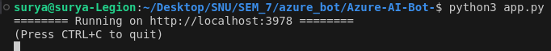
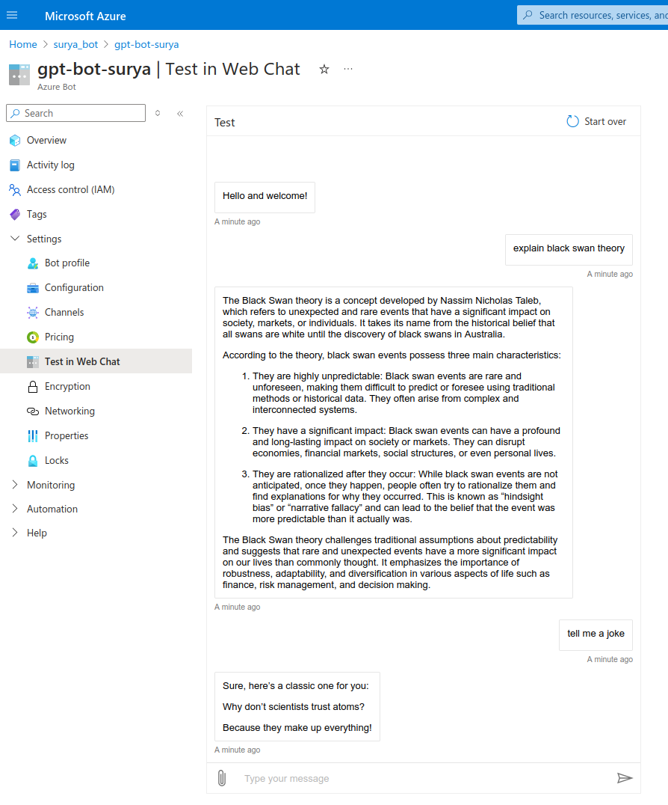

# Azure Bot Integrated with gpt 3.5 turbo

A simple bot developed using Azure bot SDK framework and deployed in Azure webapp.


### 1. Clone the Repository

   1. **Open your terminal**:
    - On Windows, you can use Command Prompt, PowerShell, or Git Bash.
    - On macOS or Linux, use the terminal.

 2. **Clone the repository**:
    - Run the following command in your terminal to clone the Bot repository:
        
        ```bash
        git clone https://github.com/Surya443/Azure_Bot.git
        ```
        
    


### 2. Set Up Your Python Environment

1. **Activate your virtual environment**:
    - If you haven't set up a virtual environment, create one first:
        
        ```bash
        python -m venv myenv
        ```
        
    - Activate the virtual environment:
        - On Windows:
            
            ```bash
            myenv\Scripts\activate
            ```
            
        - On macOS/Linux:
            
            ```bash
            source myenv/bin/activate
            ```
            
2. **Install required packages**:
    - Install the dependencies listed in `requirements.txt`:
        
        ```bash
        pip install -r requirements.txt
        ```
        

### 3. Run Your Bot

1. **Run the bot**:
    - Start the bot by running:
        
        ```bash
        python app.py
        ```
        or
        ```bash
        python3 app.py
        ```
        
    - The terminal should display a message indicating that the bot is running, typically on `http://localhost:3978`.
      

### Testing the Bot Using Bot Framework Emulator

The Bot Framework Emulator is a desktop application that allows you to test and debug your bot locally.

### 1. Install Bot Framework Emulator

1. **Download the Bot Framework Emulator**:
    - Visit the [Bot Framework Emulator releases page](https://github.com/Microsoft/BotFramework-Emulator/releases).
    - Download the installer for your operating system (Windows, macOS, or Linux).
2. **Install the Emulator**:
    - Run the installer and follow the on-screen instructions to complete the installation.

### 2. Connect to the Bot Using Bot Framework Emulator

1. **Launch the Bot Framework Emulator**:
    - Open the application you just installed.
2. **Open your bot**:
    - In the Emulator, go to `File -> Open Bot` or click the "Open Bot" button.
3. **Enter the Bot URL**:
    - In the "Bot URL" field, enter the URL where your bot is running locally:
        
        ```
        http://localhost:3978/api/messages
        ```
        
4. **Connect to the bot**:
    - Click the "Connect" button. The Emulator should now be connected to your bot.

### Testing Your Bot

1. **Interact with your bot**:
    - In the Bot Framework Emulator, you can type messages in the chat window.
    - The bot should reply with the messages that it got as response from gpt adaptor 
  


---

## Steps for Deploying the Bot in Azure Web-App and Testing It in Web-Chat using Visual Studio Code


### 1. Open `command.txt` and Copy the Start-Up Command:

- This command will help speed up the startup process of your bot.


### 2. Set the Startup Command in Azure Web-App:

- Navigate to your Azure Web-App service in the Azure portal.
- Go to **Configuration** settings.
- In the **General settings** section, find the **Startup Command** box.
- Paste the command you copied from `command.txt` and save the changes.


### 3. Copy the Default Domain URL:

- Go to the **Overview** tab of your Web-App.
- Copy the default domain URL provided there.


### 4. Configure the Messaging Endpoint in Azure Bot:

- Navigate to your Azure Bot service in the Azure portal.
- Go to **Configuration** settings.
- Paste the copied URL into the **Messaging endpoint** field.


- Append `/api/messages` to the end of the URL.
- Enable the **Streaming Endpoint** if required and apply the changes.

### 5. Update Bot Configuration in `config.py`:

- Open the `config.py` file in your bot project.
- Add your Azure Bot's ID and Password (you can find these in the **Configuration** settings of your Azure Bot).


### 8. Open Your Project in Visual Studio Code:

- Open the folder containing your bot project in Visual Studio Code.

### 9. Sign In to Azure in Visual Studio Code:

- Make sure you are signed in with your Azure account in Visual Studio Code.


- Log in to the Azure Account extension and ensure the Azure App Service extension is enabled.

### 10. Deploy the Bot to Azure Web-App:

- In Visual Studio Code, go to the side extensions bar and select **Azure**.
- Expand your **Subscription** and then **App Services**.


- Right-click on your App Service and select **Deploy to Web App**.
- Select the path of your bot project folder and deploy it.

### 10. Connect to Log Streaming (Optional):

- If needed, connect to the log streaming in Azure to monitor logs and ensure your bot is running smoothly.

### 11. Test in Web Chat:

After receiving the deployment success message in Visual Studio Code, head to web-app and check if the default domain URL is up and working by clicking on it (shouldn’t show any ‘Application Error’ message). If no errors faced then follow the following steps.

- Head to the **Test in Web Chat** option in your Azure Bot service.
    

    
- You can now interact with your Bot to ensure it is working as expected.



By following these steps, you should be able to successfully deploy your Bot to Azure Web-App and test it using Web Chat.
